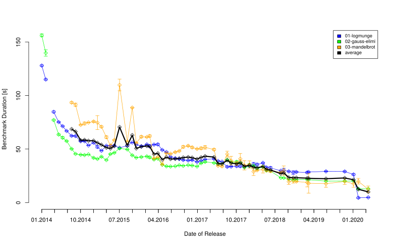
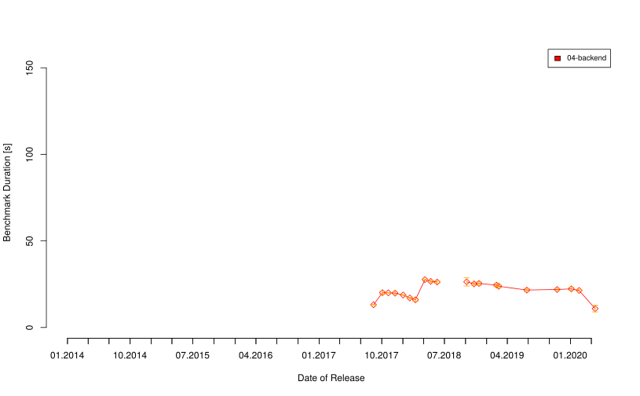

# Yet Another Perl 6 Benchmark

## Goals

This project is trying to write another benchmark for the Perl 6 runtime. I am massively impressed by the work at http://tux.nl/Talks/CSV6/speed4.html, but would also be interested how current runtime versions perform for other workloads.

The specific goals of this becnhmark are:

* Allow comparison of recent versions of the Perl 6 runtime
* Broken down into a few sub-benchmarks focusing on different aspects of the language
* Have non-trivial cases inspired by real-world loads, so less synthetic benchmarks
* Avoid non-core modules so that the benchmark compares runtime performance and not improvements in these modules

## Status and Todos

This is in a very early state, amongst other thigns it needs:

* Fixes to make the "backend" test reliable and meaningful
* Use actual Complex in 03-mandelbrot
* More sub-benchmarks for other aspects of the language
* Reviews of the existing benchmarks to make them more idomatic (not to optimize them in terms of performance)

Please help!

## The Benchmarks

### 01-logmunge

This benchmark simulates logfile analysis, so primarily regular expression matching and other text processing.

### 02-gauss-elimination

This benchmark solves a large system of linear equation using exact maths, focusing on rational number performance.

### 03-mandelbrot

This is a simplistic implementation of a mandelbrot image generator. It is a much more small-scale benchmark than the others, and focuses on iteration and floating point performance.

### 04-backend 

This emulates a service-oriented backend by setting up multiple servers that communicate over a HTTP-like protocol. It involves concurrency, promises, network I/O and text processing. This benchmark is broken for many versions of perl 6 and gives unstable resutls for older ones. It probably only makes sense from 2018.09 onwards. Any help on getting a comparable benchmark that works across versions welcome!

## Results

Below are the results, lower numbers are better of course.

The results for the currently backend benchmark, see above for caveats:

### Test System

These tests were run on a 8-core Xeon E3-1245v3 at 3.40GHz with 32GB of memory. 

